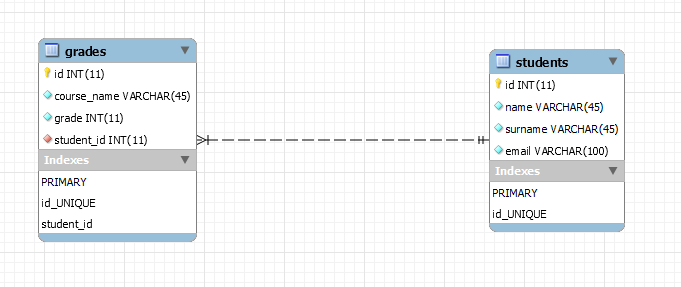

# Databases-PHP-Demo

Adapted from [Databases-Java-Demo](https://github.com/ChristosHadjichristofi/Databases-Java-Demo) and [Databases-NodeJS-Demo](https://github.com/ChristosHadjichristofi/Databases-NodeJS-Demo), originally by [Christos Hadjichristofi](https://github.com/ChristosHadjichristofi).

## Dependencies
 
 - [MySQL](https://www.mysql.com/)
 - [Apache Server](https://httpd.apache.org/)
 - [PHP](https://www.php.net/)

These dependencies can either be installed as a stack (e.g. LAMP, XAMPP, etc.) or individually. If you select to install each dependency individually you must configure the appropriate files for Apache and MySQL Servers.

## Additional Software

 - [phpMyAdmin] (https://www.phpmyadmin.net/)

phpMyAdmin is a free software tool written inh PHP, intended to handle the administration of MySQL over the Web. phpMyAdmin may be included in the aforementioned technology stacks, otherwise it has to be installed manually.

## Project Structure

After installing and configuring the software dependencies for this project, the files of this repository must be placed in the driectory specified by Apache configuration files as "DocumentRoot". 

Most of the AMP(Apache-MySQL-PHP) stacks contain a folder named "htdocs", which is preconfiguerd as the "DocumentRoot" driectory. In these cases, the repo files must be copied in that folder.

_The demo's toy database is created and populated by_ `db-project-demo.sql`.

## Note for Linux users

Applications that run without `sudo` privileges often are not allowed to connect to MySQL with the _root_ user. In order to overcome this problem, you should create a new MySQL user an grant him privileges for this demo application. Follow these steps:

1. Open a terminal and precede the `mysql` command with `sudo` to invoke it with the privileges of the root Ubuntu user in order to gain access to the root MySQL user. This can be done using  
`sudo mysql -u root -p`.
2. Create a new MySQL user using:  
`mysql> CREATE USER 'type_username'@'localhost' IDENTIFIED BY 'type_your_password_here_123';`
3. Grant the user root privileges on the application's database using:  
`mysql> GRANT ALL PRIVILEGES ON demo.* TO 'type_username'@'localhost' WITH GRANT OPTION;`
4. Reload the grant tables to ensure that the new privileges are put into effect using:
`FLUSH PRIVILEGES;`.
5. Exit MySQL with `mysql> exit;`.
7. Go to `dbdemo/__init__.py` and change the `app.config["MYSQL_USER"]` and `app.config["MYSQL_PASSWORD"]` lines according to the username and the password you chose before.

For more details read [this](https://www.digitalocean.com/community/tutorials/how-to-create-a-new-user-and-grant-permissions-in-mysql).
    
## Screenshots

## Relational Schema of Database

